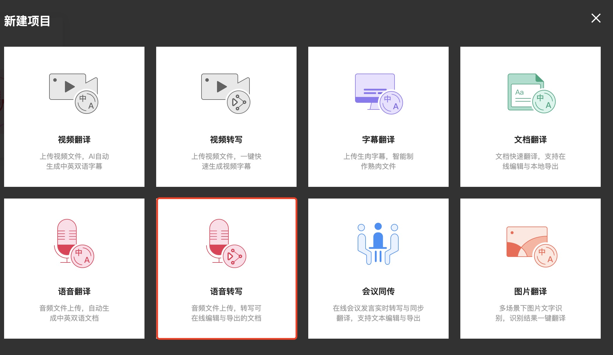

> 为了让我们制作和校验字幕使用方法和流程更明晰化，所以我们将在此做一个简单的介绍

## 方式一(Final Cut Pro X + Caption Converter + 网易见外)

### 下载视频
视频下载就不做过多的介绍了，视频下载主要还是为了方便将视频中的语音导出后，自动生成一份视频的字幕。

### 视频转换字幕
- 打开 Final Cut Pro X(不建议大家使用盗版)
  - 要将 `.mp4` 文件后缀名改为 `.mov`，修改完成后在 Final Cut Pro X 中 新建事件->新建项目，并导入媒体文件
  - 分享 `母版文件(默认)` ，设置格式为*仅音频*，音频格式为*MP3*,操作*默认*，点击下一步，然后选取存储位置，点击*存储*
  
  
  
  
  
- 登录*网易见外*,新建项目，选择*语音撰写*
  - 填写*项目名称*
  - 上传*音频文件*
  - *文件语言*按照实际情况选择
  - *出稿类型*选择*字幕*
  - 点击*提交*
  - 大概等待1-2分钟左右，点击对应的项目进入
  - 然后*导出*
  
  
  
- 打开 Caption Converter
  - 点击 *IMPORT FILE*
  - 选中导出的 *srt* 文件，点击 `OPEN`
  - 点击 `EXPORT`
    - 将 Format 修改为 `SubRip(SRT)`
    - Save as 里的内容后缀修改为 `srt`
    - 点击 `Save`
  
  
  

- 切换到 Final Cut Pro X
  - 点击`文件`
  - 选中`导入`->选中`字幕`
  - 选中从`Caption Converter`中导出的 srt 字幕文件(注：导入时语言要选择默认的英语，否则会导致无法单独导出字幕)，然后就可以开始边观看视频进行字幕校对了
  - 选中字幕的每一个块，遇到有问题的，可以直接修改
  
  
  
  

- 如需单独导出字幕文件，可以点击*文件 -> 导出字幕* 即可

- 如需将视频合成，则可选择分享 *Apple 设备 720p/1080p/4K*,设置为
  - 格式：电脑
  - 视频编解码器：按需选择
  - 分辨率：按需选择
  - 操作：仅存储
  - 点击*下一步*
  - 对文件进行重命名，点击*存储*即可
